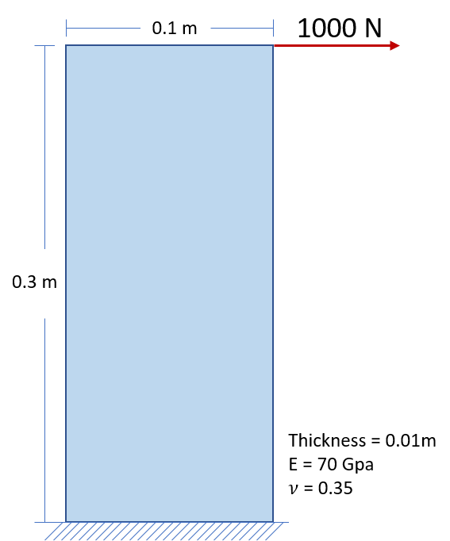
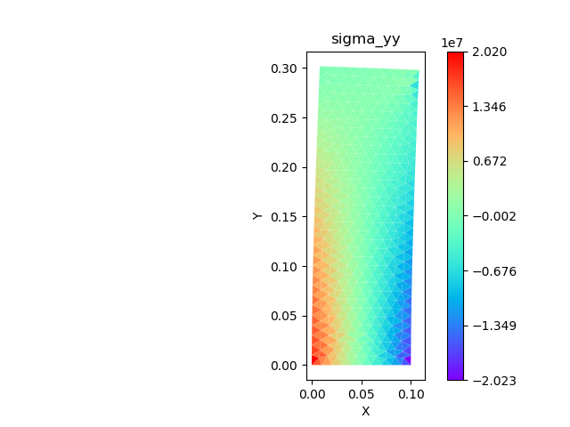

basicfem
========

basicfem is a finite element solver library in Python for 2D trusses, frames, 
and general 2D structures. Input data can be provided via simple txt files or 
a .xlsx file, For  2D general structures, the input mesh can be generated 
from the Gmsh software (https://gmsh.info/). The mshreader.py can then be used 
to convert .msh file into basicfem input format.

Quick Start
-----------

A simple example of vertical 2D plate under a point load is as follows.

After cloning the project in the local directory, try input files in the
**input_examples** folder. The command line usage is 
``python basicfem.py <input_directory> <output_directory>`` ::

    python basicfem.py input_examples/03_vertical_plate output_example/03_vertical_plate

If the assigned output directory does not exist, a new folder will be created,
otherwise the output files will be overwritten.

After the solver completes the input processing, contour plots and data can be
found in the output directory. For this example we have 
``deformation_scale_factor = 5``, which can be changed in the param.txt file
of the input folder.

We can also use an .xlsx file to replace the input directory as follows ::

    python basicfem.py input_examples/03_vertical_plate.xlsx output_example/03_vertical_plate

Which will yield an identical result.